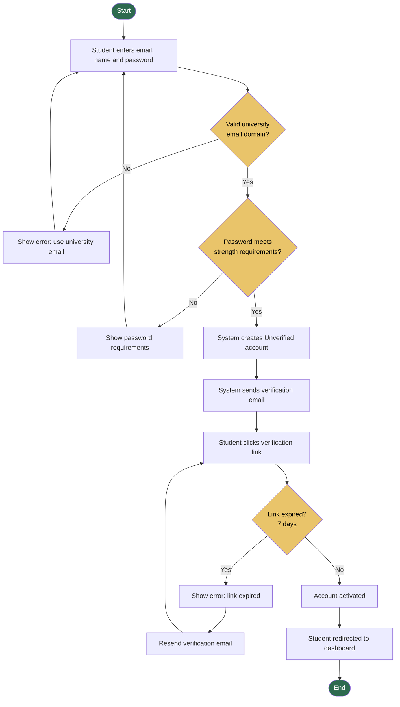
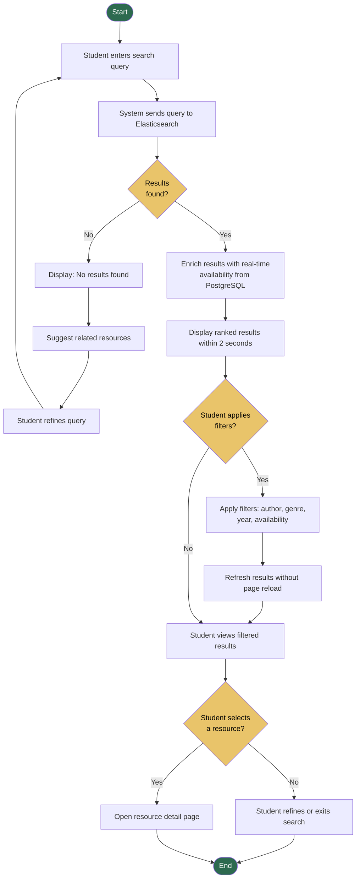
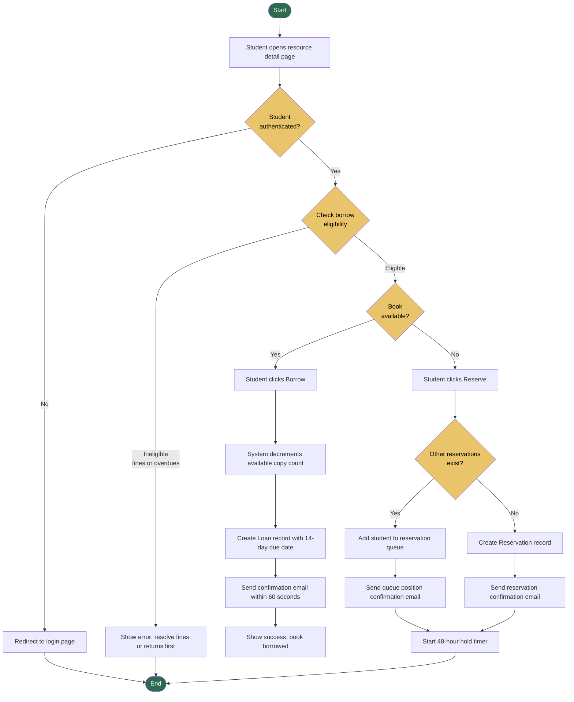
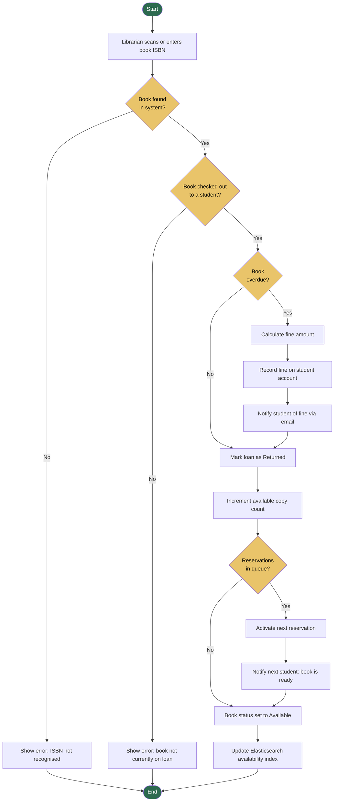
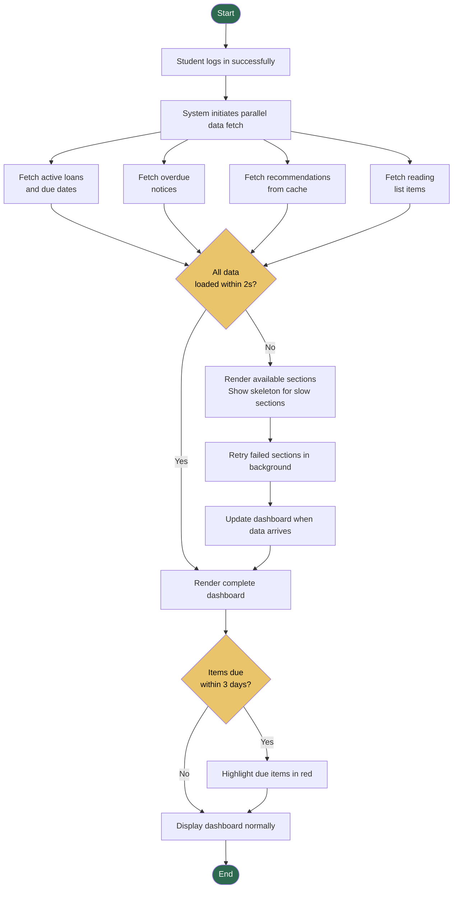
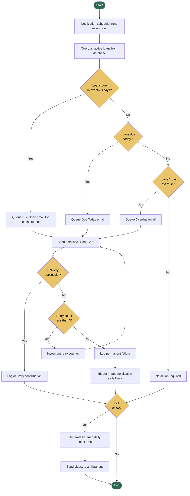
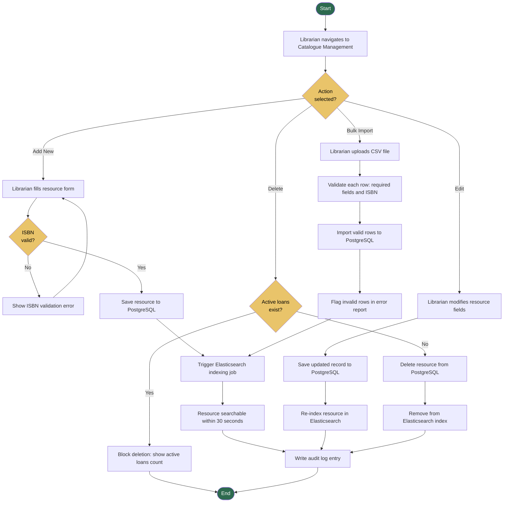
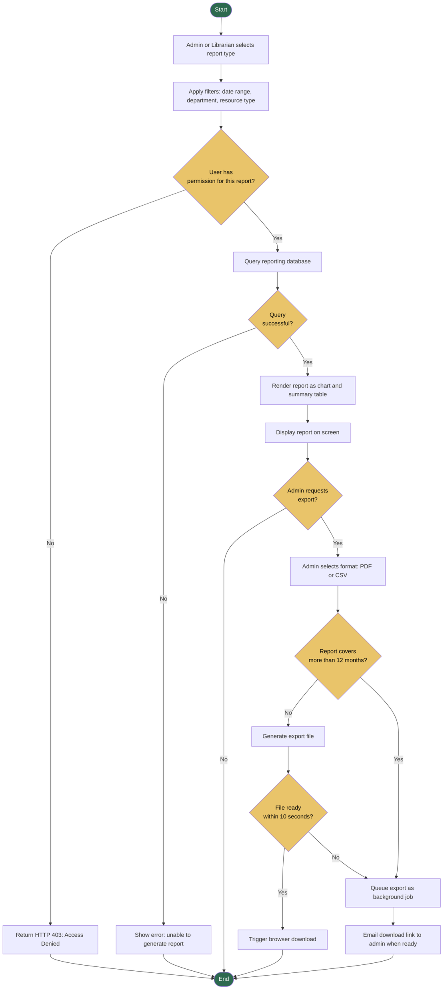

# ACTIVITY_DIAGRAMS.md — Activity Workflow Modeling
## Smart Academic Library Assistance System (SALAS)

> Assignment 8: Object State Modeling and Activity Workflow Modeling
> Building on Assignments 3–7 | Version 1.0 | April 2026

---

## 1. User Registration Workflow

### Explanation

**Swimlane roles:** Student, System, Email Service

**Workflow summary:** This activity covers FR-01 (Student Registration). The two decision nodes enforce password strength and university email domain validation. The email verification loop handles the case where a student's verification link expires before use.

**Stakeholder concern addressed:** Students need a secure, institution-linked account. The domain validation guard ensures only enrolled students can access the system.

**US traceability:** US-002 (Student registration and login) | Sprint 1

---

## 2. Search Library Catalogue Workflow

### Explanation

**Swimlane roles:** Student, Search Service (Elasticsearch), Database (PostgreSQL)

**Workflow summary:** This covers FR-02 (Search). The parallel enrichment step — combining Elasticsearch relevance scoring with real-time availability from PostgreSQL — is a key architectural pattern ensuring results are both relevant and accurate.

**Stakeholder concern addressed:** Students' top pain point is finding resources quickly. The 2-second response time requirement (NFR-12) is enforced at the display step.

**US traceability:** US-001 (Search library catalogue) | Sprint 1

---

## 3. Borrow / Reserve a Book Workflow

### Explanation

**Swimlane roles:** Student, System API, Database, Notification Service

**Workflow summary:** This covers FR-03 (Borrowing and Reservation). The eligibility check enforces the guard condition from FR-03: borrowing is blocked if the student has 3+ overdue items or fines exceeding R100. The parallel flows for borrowing vs reserving show how the system handles both scenarios from a single entry point.

**Stakeholder concern addressed:** Students want to reserve resources without visiting the library. Librarians need inventory accuracy. Both are addressed by the immediate inventory decrement and confirmation email steps.

**US traceability:** US-003 (Borrow/reserve a book) | Sprint 2

---

## 4. Return a Book Workflow

### Explanation

**Swimlane roles:** Librarian, System API, Database, Notification Service

**Workflow summary:** This covers the return lifecycle from UC12 (Return Borrowed Book). The decision at the overdue check automatically calculates and records fines. The queue check ensures reservations are activated immediately upon return, minimising wait time for the next student.

**Stakeholder concern addressed:** Librarians need accurate, real-time inventory. The immediate Elasticsearch update (last step) ensures search results reflect the returned book within 30 seconds.

**US traceability:** UC12 (Return Borrowed Book) | Sprint 2

---

## 5. Student Dashboard Load Workflow

### Explanation

**Swimlane roles:** Student, API Gateway, Multiple Backend Services

**Workflow summary:** This covers FR-04 (Student Dashboard). The parallel fetch step is critical — all four data sources are queried simultaneously rather than sequentially, enabling the 2-second load time (NFR-13). The skeleton loading pattern ensures the dashboard is usable even if one service is slow.

**Stakeholder concern addressed:** Students need a fast, unified view of their library activity. The parallel architecture directly addresses NFR-13 (Dashboard Load Time ≤ 2 seconds).

**US traceability:** US-004 (Student personal dashboard) | Sprint 2

---

## 6. Automated Overdue Notification Workflow

### Explanation

**Swimlane roles:** Notification Scheduler, Database, Email Service (SendGrid), Librarian

**Workflow summary:** This covers FR-07 (Automated Overdue Notifications). The three-retry loop with exponential backoff ensures reliable delivery. The 08:00 guard condition triggers the librarian digest exactly once per day.

**Stakeholder concern addressed:** Librarians want automated overdue tracking. Students want timely reminders. The parallel checking of three trigger conditions (3 days, due today, 1 day overdue) handles all cases in a single scheduler run.

**US traceability:** US-007 (Automated overdue notifications) | Sprint 2

---

## 7. Librarian Catalogue Management Workflow

### Explanation

**Swimlane roles:** Librarian, System API, PostgreSQL, Elasticsearch

**Workflow summary:** This covers FR-06 (Library Catalogue Management). Four parallel action paths (Add, Edit, Delete, Bulk Import) branch from a single entry point. The deletion guard condition (active loans check) is a critical safety mechanism that prevents data integrity issues.

**Stakeholder concern addressed:** Librarians need fast, accurate catalogue management. The Elasticsearch re-indexing step ensures search results stay current within 30 seconds of any change (FR-06 acceptance criteria).

**US traceability:** US-006 (Librarian catalogue management), US-014 (Bulk CSV import) | Sprint 2 and Sprint 3

---

## 8. Generate and Export Usage Report Workflow

### Explanation

**Swimlane roles:** Administrator, Librarian, System API, Reporting Database, Email Service

**Workflow summary:** This covers FR-08 (Usage Reporting and Analytics). The RBAC check at the start enforces FR-10 — admin-only reports return HTTP 403 for librarians. The large-report queue handles the alternative flow from UC08 where exports exceeding 12 months are processed as background jobs.

**Stakeholder concern addressed:** University administrators need data-driven procurement insights. The export functionality with background queuing ensures even large, complex reports are always deliverable.

**US traceability:** US-008 (Usage reports and analytics) | Sprint 3
