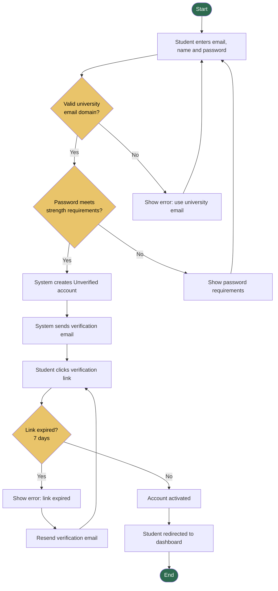
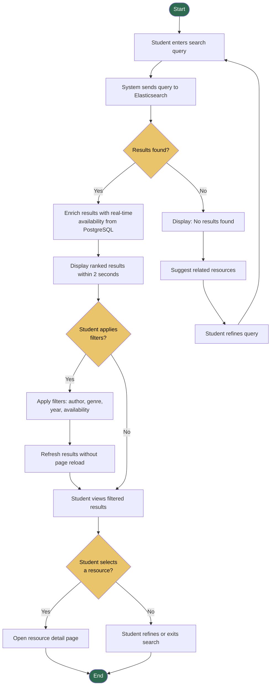
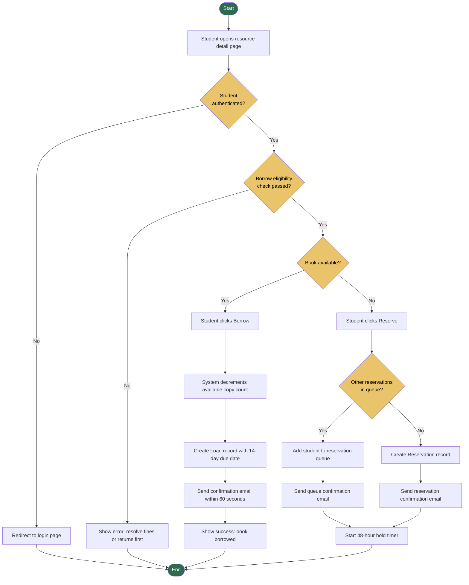
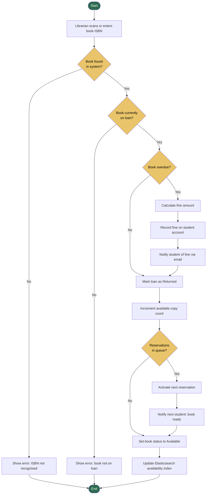
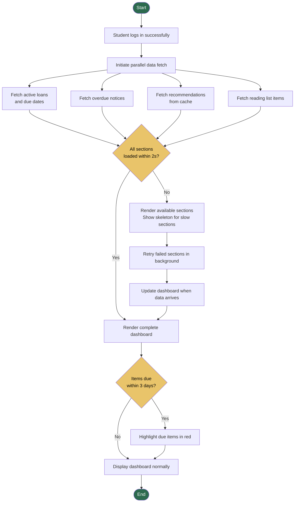
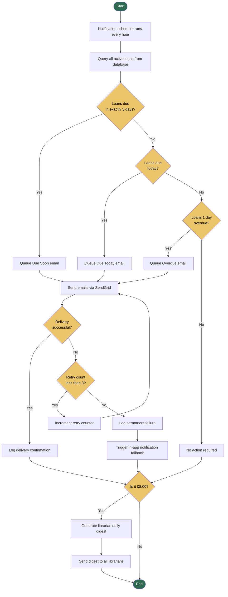
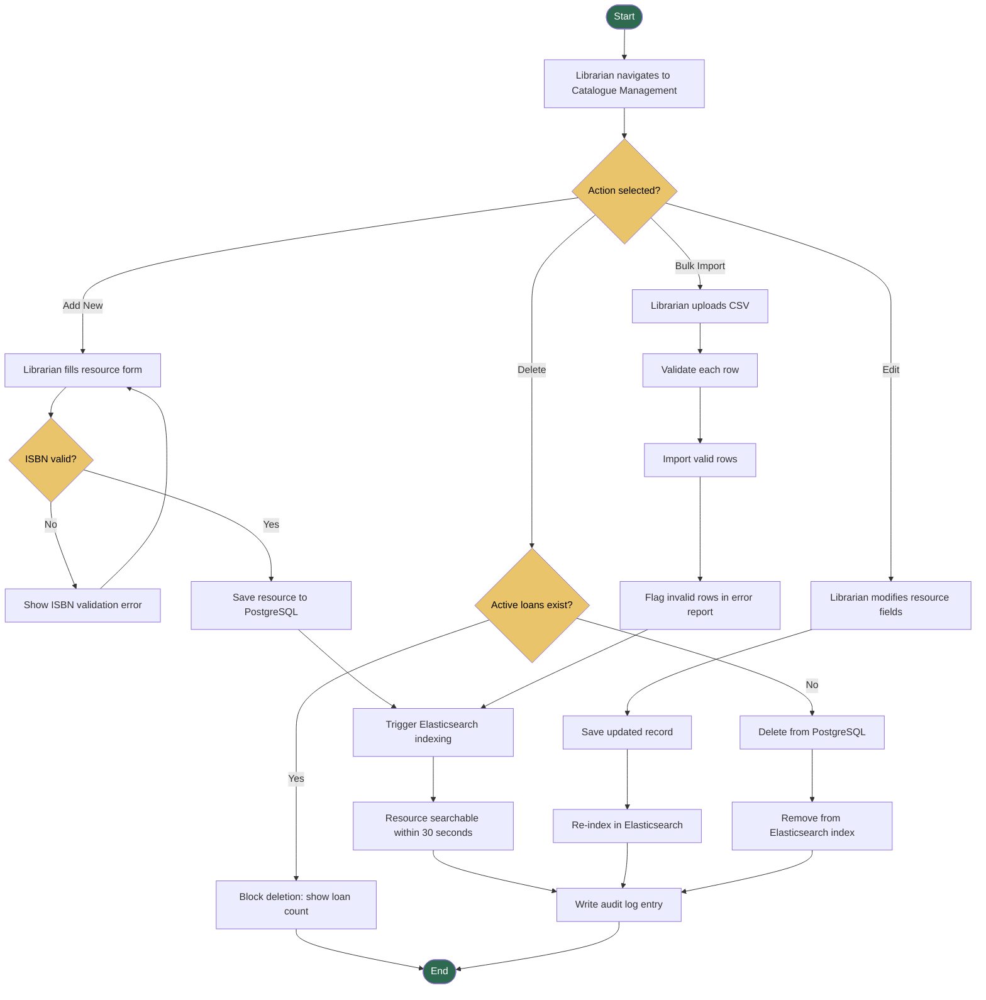
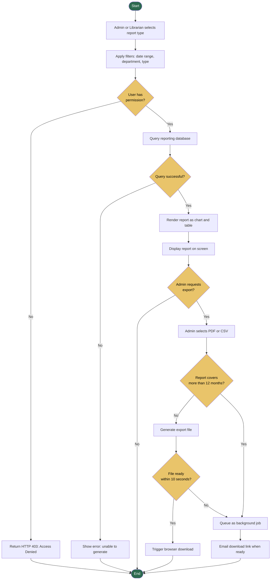

[ACTIVITY_DIAGRAMS.md](https://github.com/user-attachments/files/26781208/ACTIVITY_DIAGRAMS.md)
# ACTIVITY_DIAGRAMS.md — Activity Workflow Modeling
## Smart Academic Library Assistance System (SALAS)

> Assignment 8: Object State Modeling and Activity Workflow Modeling
> Building on Assignments 3–7 |19 April 2026

---

## 1. User Registration Workflow

### Explanation

**Swimlane roles:** Student, System, Email Service

**Workflow summary:** This activity covers FR-01. Two decision nodes enforce password strength and university email domain validation. The email verification loop handles link expiry with an automatic resend path.

**Stakeholder Value**
This workflow ensures only enrolled university students can create accounts, protecting the system from unauthorised access while providing a smooth self-service onboarding experience. IT administrators benefit from the built-in lockout and verification controls that enforce security policy without manual intervention.

**Related Functional Requirements**
- FR-01: User registration and authentication
- NFR-10: Brute-force and authentication security

**Sprint Traceability:** US-002 (Student registration and login) | Sprint 1

---

## 2. Search Library Catalogue Workflow

### Explanation

**Swimlane roles:** Student, Search Service (Elasticsearch), Database (PostgreSQL)

**Workflow summary:** This covers FR-02. Elasticsearch returns ranked results which are enriched with live availability data from PostgreSQL. Filters are applied without a page reload, meeting the usability acceptance criteria.

**Stakeholder Value**
This workflow directly addresses the primary student pain point: finding resources quickly. The 2-second response requirement (NFR-12) is enforced at the display step. Librarians benefit from accurate real-time availability being surfaced automatically, reducing enquiries at the desk.

**Related Functional Requirements**
- FR-02: Natural language and filtered resource search
- NFR-12: Search response time under 2 seconds

**Sprint Traceability:** US-001 (Search library catalogue) | Sprint 1

---

## 3. Borrow / Reserve a Book Workflow

### Explanation

**Swimlane roles:** Student, System API, Database, Notification Service

**Workflow summary:** This covers FR-03. The eligibility check blocks borrowing when fines exceed R100 or overdue items exceed 3. Parallel flows handle borrowing vs reserving from a single entry point. This workflow directly supports the Sprint 2 user story focused on real-time availability checks and transaction processing.

**Stakeholder Value**
Students benefit from a fully online borrow and reserve process, eliminating the need for in-person visits. Librarians benefit from real-time inventory accuracy — the immediate decrement of available copies prevents double-booking. The automated confirmation email reduces front-desk enquiries and supports scalability.

**Related Functional Requirements**
- FR-03: Book borrowing and reservation
- FR-07: Automated confirmation notifications

**Sprint Traceability:** US-003 (Borrow/reserve a book) | Sprint 2

---

## 4. Return a Book Workflow

### Explanation

**Swimlane roles:** Librarian, System API, Database, Notification Service

**Workflow summary:** This covers UC12. The overdue check automatically calculates and records fines. The queue check activates the next reservation immediately upon return, minimising wait times.

**Stakeholder Value**
Librarians benefit from a fast, accurate return process that handles fines and queue activation automatically, reducing manual work. Students on the reservation queue benefit from immediate notification when a book becomes available. The Elasticsearch update ensures search results reflect the returned book within 30 seconds, supporting real-time accuracy for all users.

**Related Functional Requirements**
- FR-03: Borrowing and reservation lifecycle
- FR-07: Automated overdue fine notification

**Sprint Traceability:** UC12 (Return Borrowed Book) | Sprint 2

---

## 5. Student Dashboard Load Workflow

### Explanation

**Swimlane roles:** Student, API Gateway, Multiple Backend Services

**Workflow summary:** This covers FR-04. All four data sources are fetched in parallel to achieve the 2-second load requirement (NFR-13). The skeleton loading pattern ensures the dashboard remains usable even if one service is slow.

**Stakeholder Value**
Students benefit from a fast, unified view of all their library activity in a single screen. The parallel fetch architecture directly addresses the NFR-13 performance requirement. IT administrators benefit from the graceful degradation pattern, a slow recommendation service will not block the entire dashboard, maintaining perceived reliability during peak usage periods.

**Related Functional Requirements**
- FR-04: Student personal dashboard
- NFR-13: Dashboard load time under 2 seconds

**Sprint Traceability:** US-004 (Student personal dashboard) | Sprint 2

---

## 6. Automated Overdue Notification Workflow

### Explanation

**Swimlane roles:** Notification Scheduler, Database, Email Service, Librarian

**Workflow summary:** This covers FR-07. Three trigger conditions are checked in a single scheduler run. The 3-retry loop with exponential backoff ensures reliable delivery. The 08:00 guard triggers the librarian digest exactly once per day.

**Stakeholder Value**
Students benefit from timely, automated reminders that reduce overdue fines without requiring manual follow-up. Librarians benefit from a consolidated daily digest that gives full overdue visibility without needing to query the system manually. The retry and fallback logic ensures notification reliability even when the email service experiences downtime, supporting the IT administrator's uptime requirements.

**Related Functional Requirements**
- FR-07: Automated overdue notifications and retry logic

**Sprint Traceability:** US-007 (Automated overdue notifications) | Sprint 2

---

## 7. Librarian Catalogue Management Workflow

### Explanation

**Swimlane roles:** Librarian, System API, PostgreSQL, Elasticsearch

**Workflow summary:** This covers FR-06. Four action paths branch from a single entry. The deletion guard prevents data integrity issues. All changes are audit-logged.

**Stakeholder Value**
Librarians benefit from a fast, multi-action catalogue tool that handles validation, indexing, and audit logging automatically. The bulk import path addresses the pain point of large acquisitions. University administrators benefit from the audit log, which supports compliance and accountability. The Elasticsearch re-indexing ensures students always see accurate catalogue data within 30 seconds of any change.

**Related Functional Requirements**
- FR-06: Library catalogue management
- FR-02: Search relies on the Searchable state produced by this workflow

**Sprint Traceability:** US-006 (Librarian catalogue management), US-014 (Bulk CSV import) | Sprint 2 and Sprint 3

---

## 8. Generate and Export Usage Report Workflow

### Explanation

**Swimlane roles:** Administrator, Librarian, System API, Reporting Database, Email Service

**Workflow summary:** This covers FR-08. The RBAC check enforces FR-10 at entry. The background queue handles large reports exceeding the 10-second SLA. All decision branches are explicitly labelled Yes/No.

**Stakeholder Value**
University administrators benefit from data-driven procurement insights through filterable, exportable reports. The RBAC check ensures sensitive system-wide reports are restricted to authorised roles, satisfying IT administrator security requirements. The background export queue ensures even large historical reports are always deliverable, supporting the administrator's need for complete data access without system timeouts.

**Related Functional Requirements**
- FR-08: Usage reporting and analytics
- FR-10: Role-based access control enforced at the permission check

**Sprint Traceability:** US-008 (Usage reports and analytics) | Sprint 3
