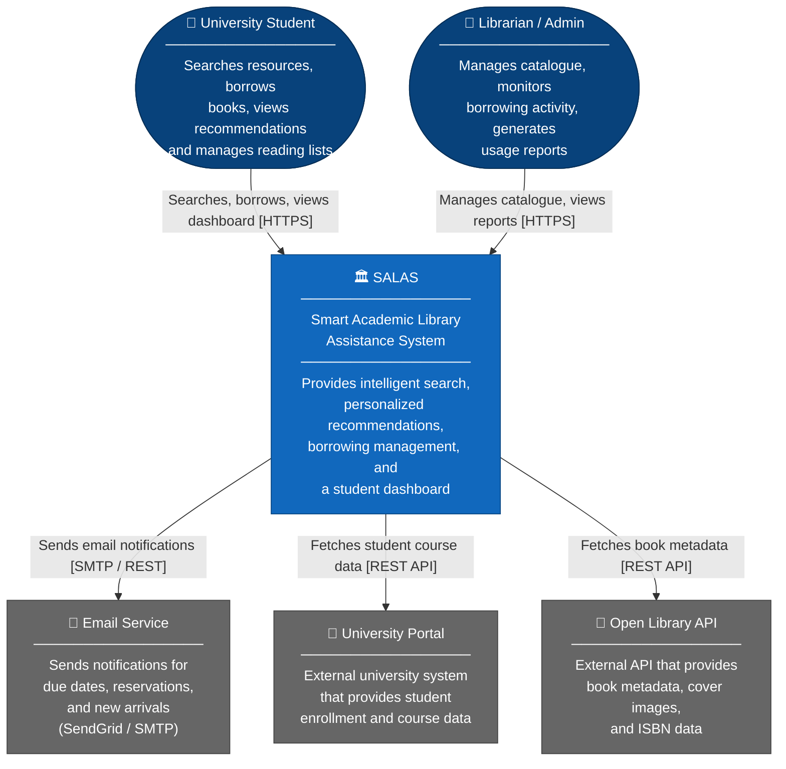
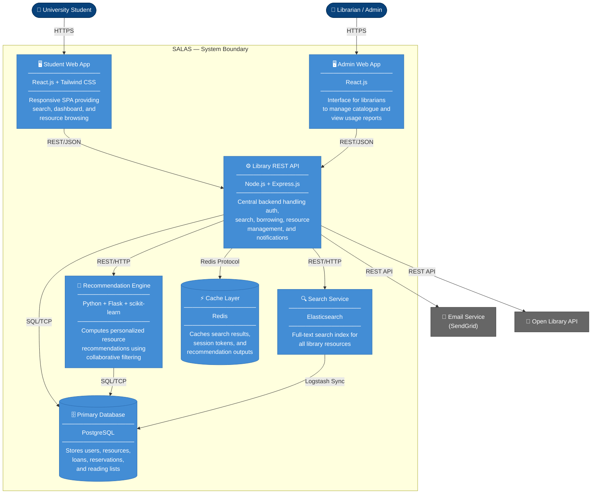
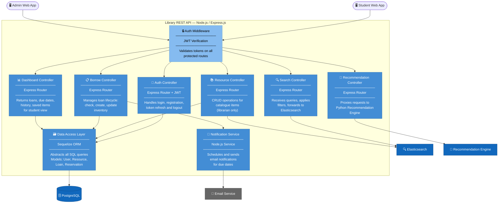
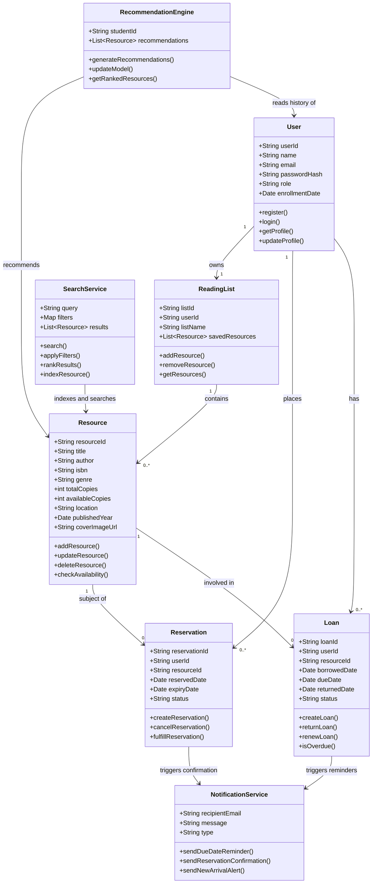

# ARCHITECTURE.md Smart Academic Library Assistance System (SALAS)

> C4 Model Architectural Diagrams using GitHub-compatible Mermaid syntax  
> Covers: Context → Container → Component → Code (Class Diagram)

---

## Project Title
**Smart Academic Library Assistance System (SALAS)**

## Domain
**University Library / Higher Education**

The university library domain involves students, faculty, and librarians interacting with physical and digital academic resources. The system integrates with institutional infrastructure such as email services and university portals to provide a seamless resource access experience.

## Problem Statement
Students struggle to efficiently find, borrow, and track academic resources due to fragmented, unintelligent library systems. SALAS unifies search, recommendations, borrowing, and resource management into one cohesive platform.

## Individual Scope
SALAS is decomposed into independently buildable modules (Search, Recommendation Engine, Student Dashboard, Resource Management, Library API), making it feasible for a single developer to implement incrementally over one semester.

---

## C4 Level 1: System Context Diagram

> Shows who uses SALAS and what external systems it interacts with.

---

## C4 Level 2: Container Diagram

> Shows the major deployable containers inside SALAS and how they communicate.

---

## C4 Level 3: Component Diagram (Library REST API)

> Zooms into the Library REST API container and shows its internal components.

---

## C4 Level 4: Code Diagram (Class Diagram)

> Illustrates the key classes and relationships for the core domain model.

---

## Architecture Summary

| C4 Level | Diagram | Key Insight |
|---|---|---|
| **Level 1: Context** | System in its environment | SALAS serves students and librarians; integrates with email, university portal, and Open Library API |
| **Level 2: Container** | Deployable services | 7 containers: React SPA, Admin SPA, REST API, Recommendation Engine, Elasticsearch, PostgreSQL, Redis |
| **Level 3: Component** | API internals | 8 components inside the API: Auth Middleware, Auth, Search, Resource, Borrow, Dashboard, Recommendation, Notification, and Data Access Layer |
| **Level 4: Code** | Class-level design | 8 core classes covering users, resources, loans, reservations, reading lists, recommendations, search, and notifications |

The architecture follows a **microservices-lite** pattern: a central REST API handles most logic, while the computationally intensive Recommendation Engine is separated as an independent Python microservice. This maximises simplicity for solo development while enabling scalability.
