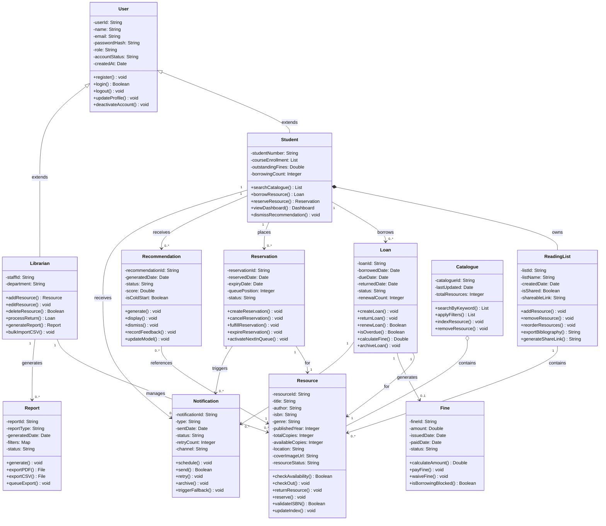

# CLASS_DIAGRAM.md — Class Diagram
## Smart Academic Library Assistance System (SALAS)

> Assignment 9: Domain Modeling and Class Diagram Development
> Building on Assignments 3–8 | 26 April 2026

---

## 1. Class Diagram

---

## 2. Key Design Decisions

### 2.1 Inheritance: User → Student and Librarian

User is defined as the base class with common authentication attributes and methods.
Student and Librarian extend User and add role-specific attributes and methods. This
avoids duplication of `userId`, `email`, `passwordHash`, and `login()` across two
separate classes. The `role` attribute on User also enables the RBAC system from
FR-10, the API middleware checks `user.role` to enforce permissions without needing
to query two separate tables.

This maps directly to UC10 (Manage Roles and Permissions) from the use case diagram
in Assignment 5 and to the User Account state diagram in Assignment 8.

### 2.2 Composition: Student owns ReadingList

ReadingList uses a composition relationship with Student (filled diamond) because a
ReadingList cannot exist independently, it is meaningfully part of the Student
object. If a Student account is deactivated and deleted (BR-07), the ReadingList is
deleted with it. This enforces the POPIA data erasure requirement from NFR-11.

### 2.3 Aggregation: Catalogue contains Resource

Catalogue uses aggregation (hollow diamond) with Resource because Resources have
independent existence, a Resource exists in the system even if it is temporarily
removed from the active Catalogue (e.g., under maintenance). This models the
UnderMaintenance state from the Resource state diagram in Assignment 8.

### 2.4 Fine as a Separate Class

Fine could have been modelled as attributes on the Loan class (e.g., `fineAmount`,
`finePaid`). The decision to make Fine a separate class was driven by business rules
BR-02 and BR-10: fines have their own lifecycle (PENDING → PAID → WAIVED), their own
methods (`calculateAmount()`, `waiveFine()`), and can be queried independently for
reporting. Embedding them in Loan would violate the Single Responsibility Principle.

### 2.5 Notification as a Standalone Class

Notifications are triggered by both Loans and Reservations, and are sent to both
Students and Librarians. Making Notification a standalone class with dependency
arrows from Loan and Reservation correctly models this many-to-one relationship
without coupling the Loan or Reservation classes to email delivery logic.

### 2.6 Multiplicity Decisions

- `Student "1" --> "0..*" Loan` — a student can have no loans (new user) or many
  loans over time, but each loan belongs to exactly one student
- `Loan "1" --> "0..1" Fine` — not every loan generates a fine; only overdue ones do
- `Recommendation "0..*" --> "1" Resource` — many recommendations can reference the
  same popular resource across different students

### 2.7 Traceability to Prior Assignments

| Class | FR / UC | State Diagram | User Story |
|---|---|---|---|
| User / Student / Librarian | FR-01, FR-10 | User Account | US-002, US-010 |
| Resource | FR-02, FR-06 | Book/Resource, Catalogue Entry | US-001, US-006 |
| Loan | FR-03, FR-07 | Loan | US-003, US-007 |
| Reservation | FR-03 | Reservation | US-003 |
| Fine | FR-03 | Loan (Escalated state) | US-003 |
| ReadingList | FR-11 | — | US-011 |
| Recommendation | FR-05 | Recommendation | US-005 |
| Notification | FR-07 | Notification | US-007 |
| Catalogue | FR-02, FR-06 | Catalogue Entry | US-001, US-006 |
| Report | FR-08 | Report | US-008 |
