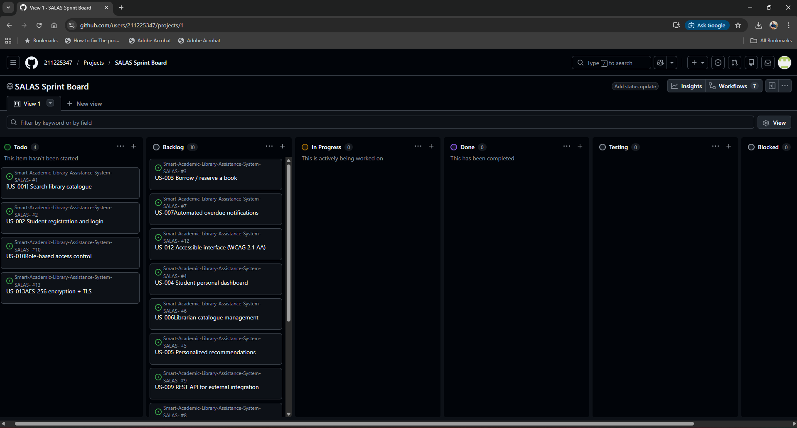
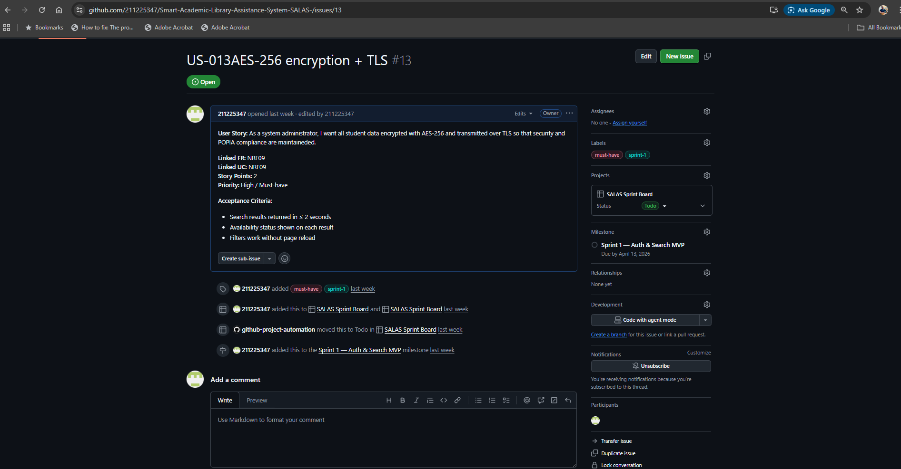
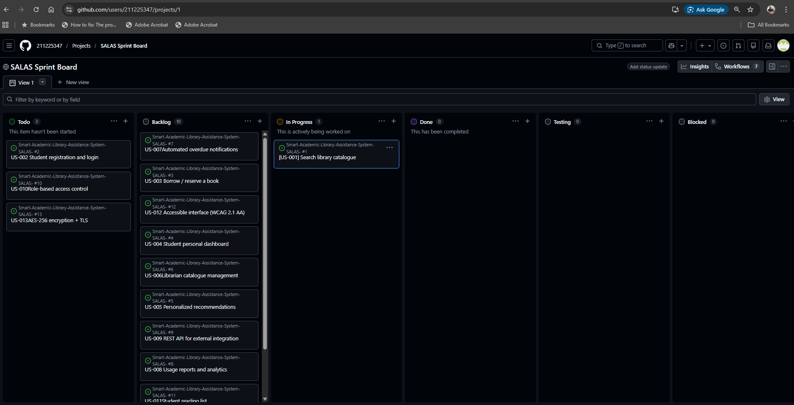

# Smart Academic Library Assistance System (SALAS)

An intelligent, AI‑powered academic library platform designed to help university students efficiently discover, access, and manage academic resources.  
This repository contains all project documentation for Assignments 3–7, covering system specification, architecture, Agile planning, and GitHub Project management.

---

## Project Overview

The Smart Academic Library Assistance System (SALAS) aims to modernize university library services through features such as natural‑language search, personalized recommendations, borrowing management, analytics dashboards, and API integration.  
Development follows Agile methodologies and is documented across multiple structured assignments.

---

## Project Documents

### **Assignment 3 — System Specification & Architecture**
| Document | Description |
|---------|-------------|
| ./SPECIFICATION.md | Full system specification, including domain analysis, functional & non‑functional requirements, and use cases |
| ./ARCHITECTURE.md | C4 architectural diagrams (Context, Container, Component, Code) |

---

### **Assignment 4 — Stakeholders & System Requirements**
| Document | Description |
|---------|-------------|
| ./STAKEHOLDERS.md | Stakeholder roles, concerns, and success metrics |
| ./SRD.md | System Requirements Document (Functional + Non‑Functional Requirements) |
| ./REFLECTION.md | Reflection on requirements elicitation and stakeholder challenges |

---

### **Assignment 5 — Use Cases & Testing**
| Document | Description |
|---------|-------------|
| USE_CASE_DIAGRAM.md | UML use case diagram |
| ./USE_CASE_SPECIFICATIONS.md | Detailed use case specifications |
| ./TEST_CASES.md | Comprehensive test cases linked to acceptance criteria |
| ./REFLECTION5.md | Reflection on modeling and test design |

---

### **Assignment 6 — Agile Planning**
| Document | Description |
|---------|-------------|
| ./AGILE_PLANNING.md | Backlog, user stories, sprint plan, story points, and prioritization |
| ./REFLECTION6.md | Reflection on Agile processes and sprint planning |

---

### **Assignment 7 — GitHub Projects & Kanban Implementation**
| Document | Description |
|---------|-------------|
| ./template_analysis.md | Comparison of GitHub project templates and justified selection of Automated Kanban |
| ./kanban_explanation.md | Explanation of SALAS Kanban board workflow, WIP limits, and Agile alignment |
| ./reflection7.md | Reflection on template selection, customization challenges, and tool comparison |

### Submission Note (Assignment 7)

This submission demonstrates the implementation of a GitHub Project using the Automated Kanban template, customized to support the Agile workflow of the Smart Academic Library Assistance System (SALAS). The Kanban board includes custom columns such as *Testing* and *Blocked*, with all Sprint 1 user stories from Assignment 6 represented as linked GitHub Issues, complete with labels, assignments, and status progression. Screenshots of the Kanban board overview, linked issue details, and automation behavior are embedded in this README under the Assignment 7 evidence section to allow independent verification. All documentation and artifacts are traceable across assignments to ensure consistency with Agile best practices.

### **Kanban Board Summary (Assignment 7)**  
A GitHub Project board was created using the **Automated Kanban** template and customized with:  
- **Testing** column to reflect acceptance‑criteria verification  
- **Blocked** column to make dependencies and impediments visible  
All Sprint 1 user stories from Assignment 6 are linked as GitHub Issues with labels, milestones, and task assignments.

Full explanation is in **kanban_explanation.md**.

## Assignment 7 – Kanban Board Evidence

### Kanban Board Overview

### Linked Issue Example

### Automation Demonstration

---

## Author  
**Phola Qwalana (211225347)**  
Software Engineering 12 April 2026  

---

## Notes for Reviewers  
This repository is structured intentionally to align with the module’s progressive assignment requirements.  
Each assignment builds on the previous one, demonstrating consistent traceability from:

**Stakeholders → Requirements → Use Cases → Test Cases → User Stories → Kanban Workflow**

This ensures a complete, end‑to‑end documentation trail consistent with industry Agile practices.
