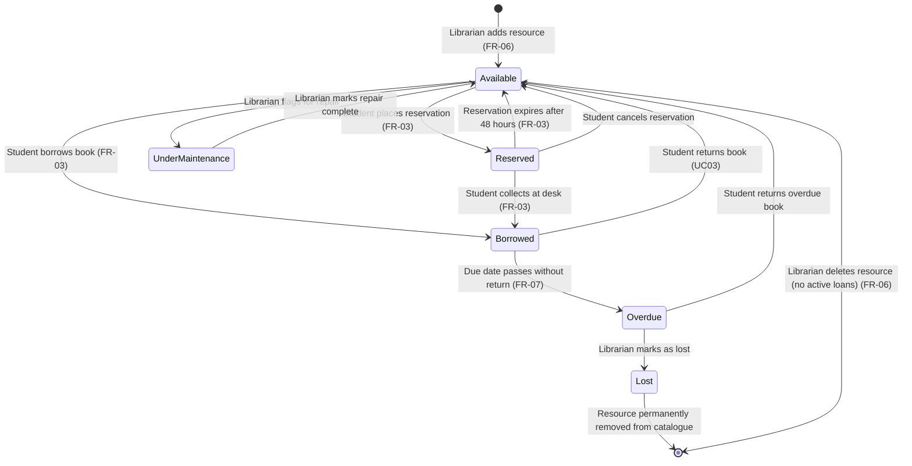
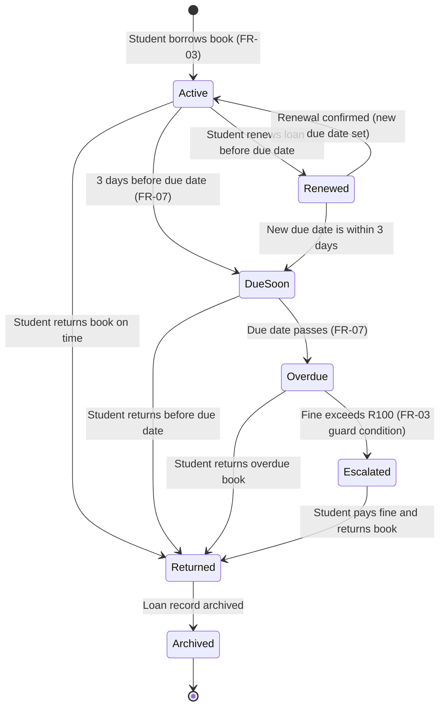
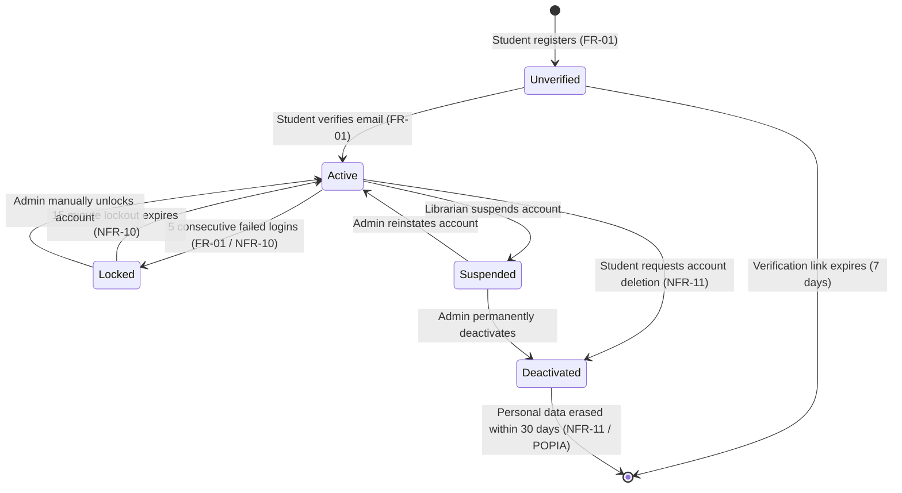
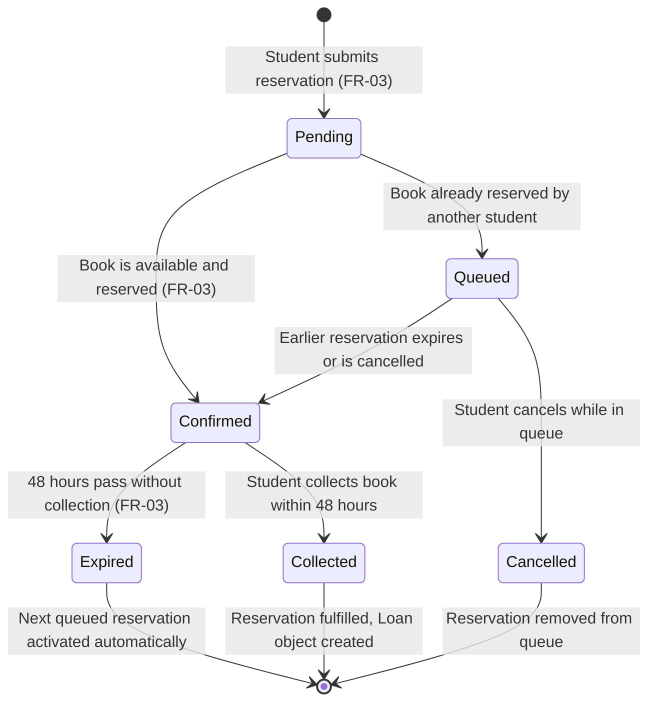
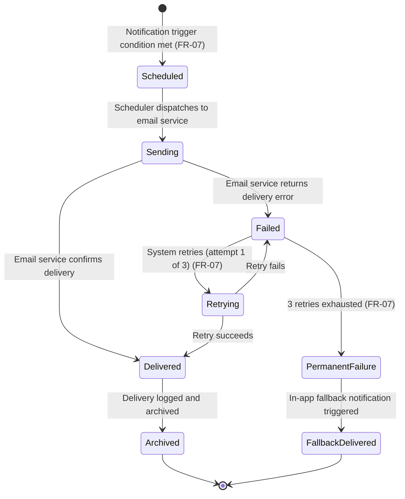
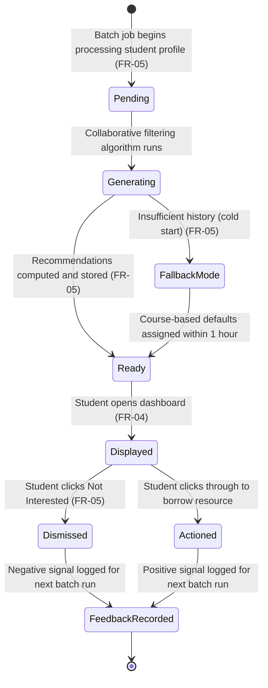
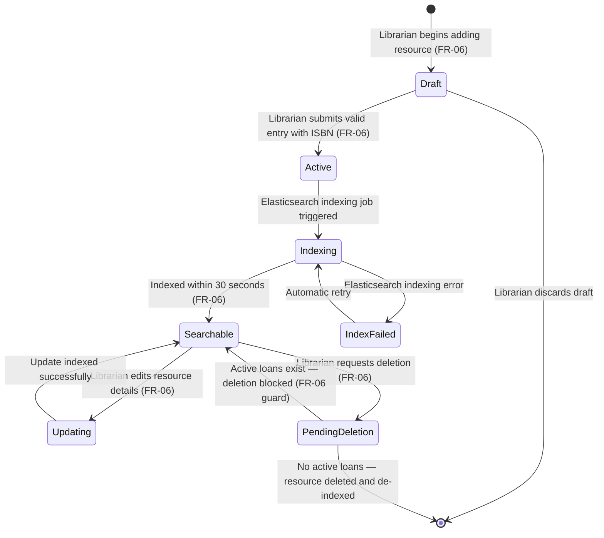
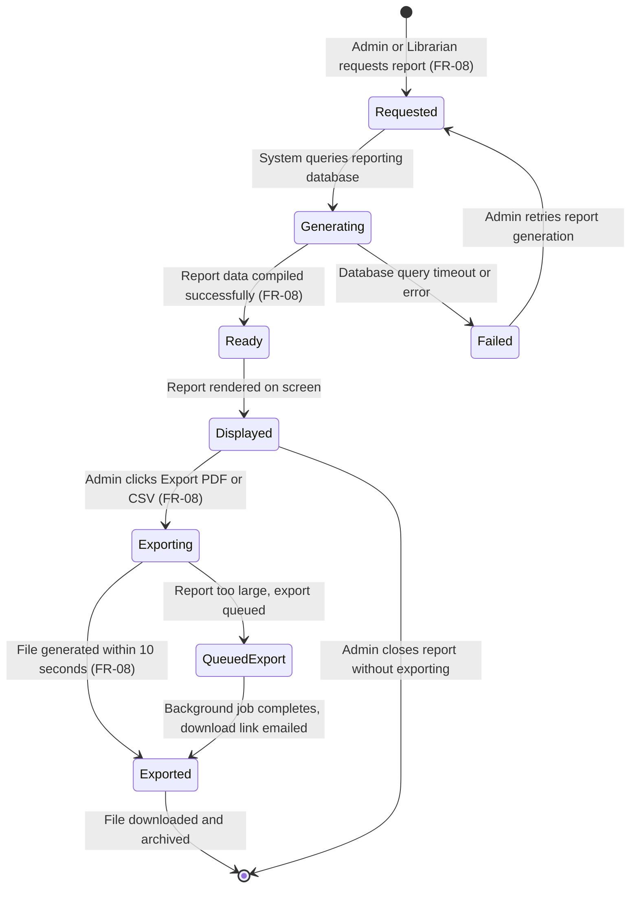

[STATE_TRANSITION_DIAGRAMS.md](https://github.com/user-attachments/files/26707030/STATE_TRANSITION_DIAGRAMS.md)
# STATE_TRANSITION_DIAGRAMS.md — Object State Modeling
## Smart Academic Library Assistance System (SALAS)

> Assignment 8: Object State Modeling and Activity Workflow Modeling
> Building on Assignments 3–7 |19 April 2026

---

## 1. Book / Resource Object

### Explanation

**Key States:** Available, Reserved, Borrowed, Overdue, UnderMaintenance, Lost

**Key Transitions:**
- A book starts as Available when added to the catalogue by a librarian (FR-06)
- It moves to Reserved when a student places an online reservation (FR-03)
- Reserved books that are not collected within 48 hours automatically revert to Available, this guard condition prevents inventory from being locked indefinitely
- A Borrowed book becomes Overdue when the due date passes without a return, triggering the notification workflow (FR-07)
- A Lost book exits the lifecycle entirely and is removed from the catalogue

**FR Mapping:**
- FR-03 (Borrowing and Reservation) governs the Available → Reserved → Borrowed transitions
- FR-06 (Catalogue Management) governs the creation and deletion of the resource
- FR-07 (Overdue Notifications) is triggered by the Borrowed → Overdue transition

---

## 2. Loan Object

### Explanation

**Key States:** Active, DueSoon, Renewed, Overdue, Escalated, Returned, Archived

**Key Transitions:**
- A Loan is created Active when a student borrows a book
- The system automatically transitions the loan to DueSoon 3 days before the due date, triggering an email notification (FR-07)
- The guard condition on the Overdue → Escalated transition enforces FR-03: borrowing is blocked when fines exceed R100
- The Returned state transitions to Archived, an explicit UML terminal state, which records that the loan is complete and increments the available copy count

**FR Mapping:**
- FR-03: Controls the Active, Overdue, and Escalated states with fine-based guard conditions
- FR-07: Triggers transitions to DueSoon and Overdue states via the notification scheduler

---

## 3. User Account Object

### Explanation

**Key States:** Unverified, Active, Locked, Suspended, Deactivated

**Key Transitions:**
- Registration creates an Unverified account; email verification moves it to Active (FR-01)
- 5 consecutive failed logins trigger a Locked state for 15 minutes, a guard condition enforcing brute-force protection (NFR-10)
- Deactivated accounts trigger POPIA-compliant data erasure within 30 days (NFR-11)

**FR Mapping:**
- FR-01 (Authentication): Governs Unverified → Active and Active → Locked transitions
- NFR-10 (Auth Security): Defines the lockout guard condition
- NFR-11 (POPIA): Governs the Deactivated → erasure lifecycle

---

## 4. Reservation Object

### Explanation

**Key States:** Pending, Confirmed, Queued, Collected, Expired, Cancelled

**Key Transitions:**
- A reservation moves from Pending to Confirmed if a copy is available, or to Queued if all copies are reserved
- The guard condition on Confirmed → Expired enforces the 48-hour hold window from FR-03
- When a Confirmed reservation expires, the system automatically activates the next Queued reservation

**FR Mapping:**
- FR-03: Governs the entire reservation lifecycle including the 48-hour expiry guard

---

## 5. Notification Object

### Explanation

**Key States:** Scheduled, Sending, Delivered, Failed, Retrying, PermanentFailure, Archived, FallbackDelivered

**Key Transitions:**
- Notifications are Scheduled when a trigger condition is met (3 days before due date, on due date, 1 day after)
- Failed deliveries are automatically Retried up to 3 times (FR-07 acceptance criteria)
- After 3 failed retries, the system moves to PermanentFailure and triggers an in-app fallback, ending in FallbackDelivered
- Successfully delivered notifications end in Archived, an explicit terminal state confirming the record is logged and the lifecycle is complete

**FR Mapping:**
- FR-07: Defines all notification trigger conditions and the 3-retry guard condition

---

## 6. Recommendation Object

### Explanation

**Key States:** Pending, Generating, Ready, FallbackMode, Displayed, Dismissed, Actioned, FeedbackRecorded

**Key Transitions:**
- The FallbackMode state handles the cold-start problem for new students with no borrowing history (FR-05 acceptance criteria)
- Both Dismissed and Actioned transitions converge on the explicit FeedbackRecorded terminal state, which confirms the student's interaction signal has been logged before the lifecycle ends
- FeedbackRecorded is the UML-compliant named final state, making it clear the object has completed its purpose rather than simply disappearing

**FR Mapping:**
- FR-05: Governs the entire recommendation lifecycle including cold-start handling
- FR-04: The Displayed state is triggered when the student's dashboard loads

---

## 7. Library Catalogue Entry Object

### Explanation

**Key States:** Draft, Active, Indexing, Searchable, IndexFailed, Updating, PendingDeletion

**Key Transitions:**
- The guard condition on PendingDeletion → Searchable enforces FR-06: deletion is blocked if active loans exist
- The Indexing state ensures resources appear in search results within 30 seconds of being added

**FR Mapping:**
- FR-06: Governs the full catalogue entry lifecycle including the deletion guard condition
- FR-02: The Searchable state enables student search functionality

---

## 8. Report Object

### Explanation

**Key States:** Requested, Generating, Ready, Displayed, Exporting, Exported, QueuedExport

**Key Transitions:**
- The QueuedExport state handles large reports (more than 12 months of data) that exceed the 10-second generation limit (FR-08 alternative flow)
- The guard on Exporting → Exported enforces the 10-second export SLA

**FR Mapping:**
- FR-08: Governs the full report lifecycle including generation, display, and export
