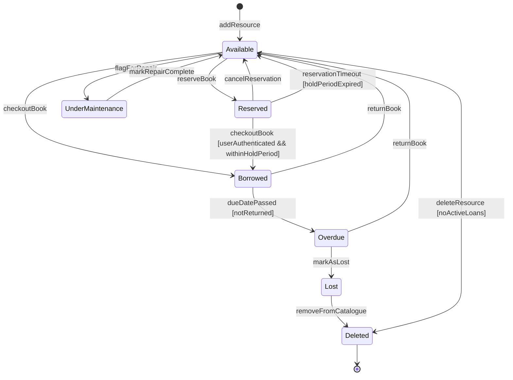
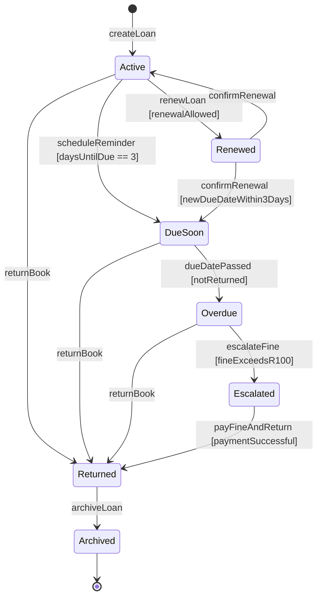
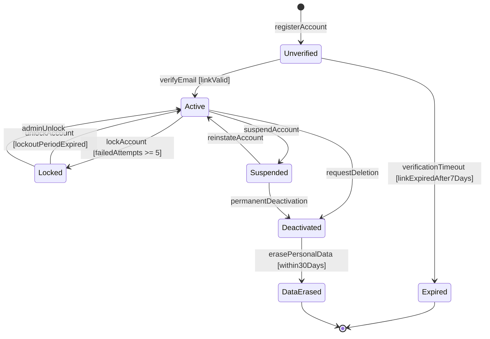
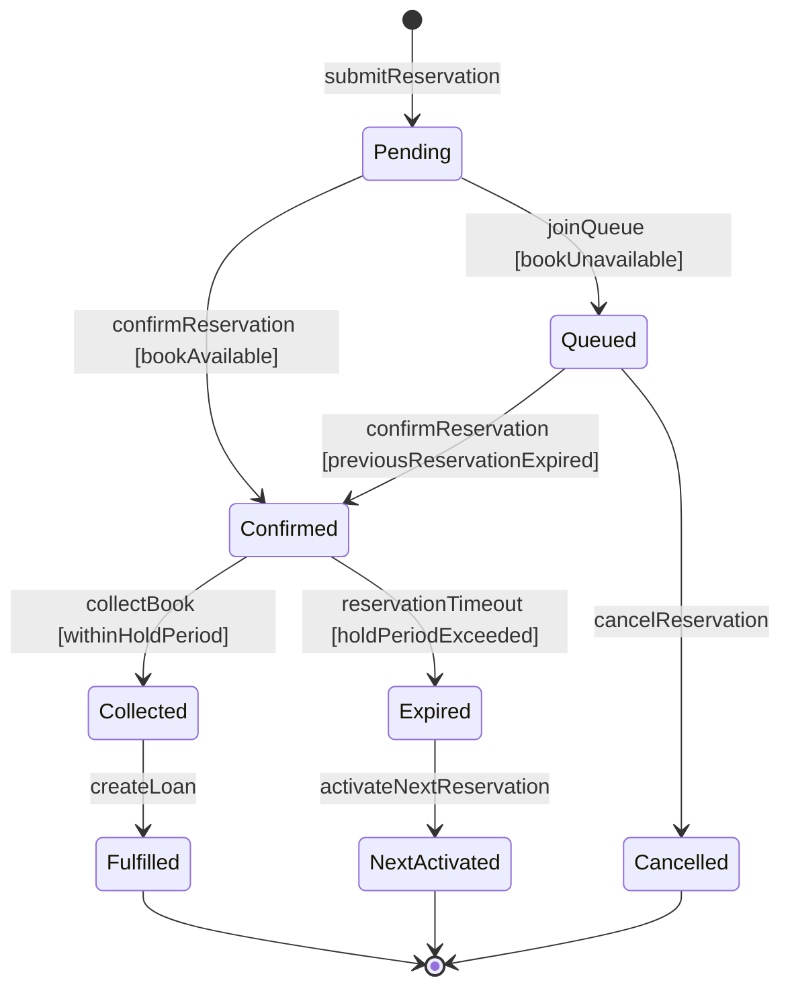
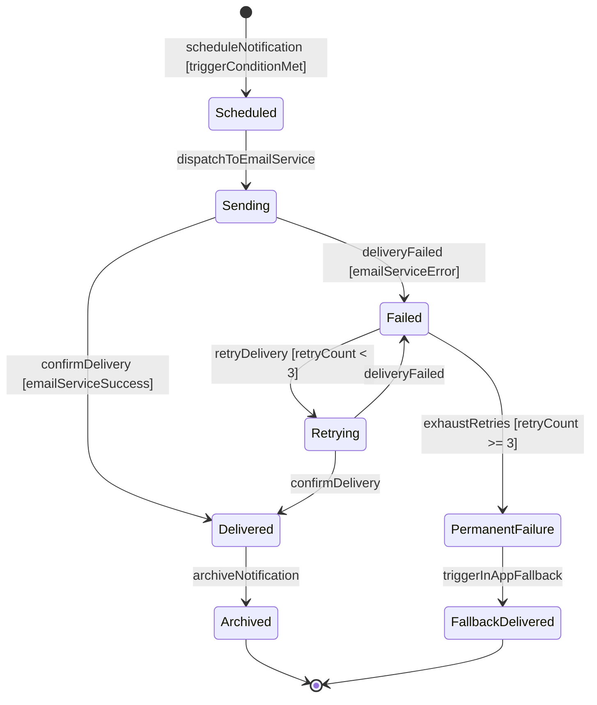
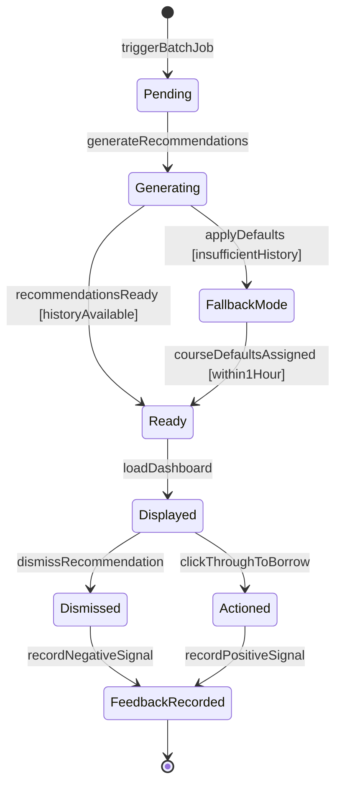
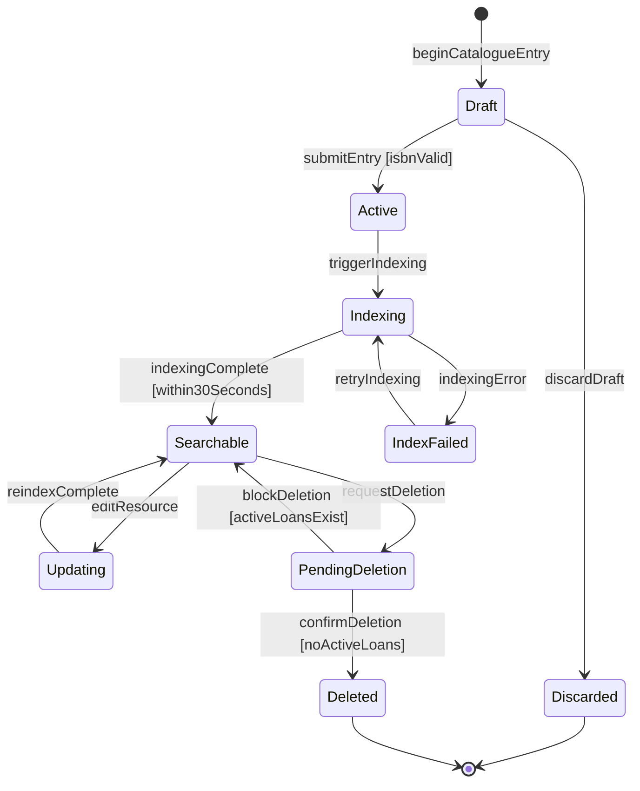
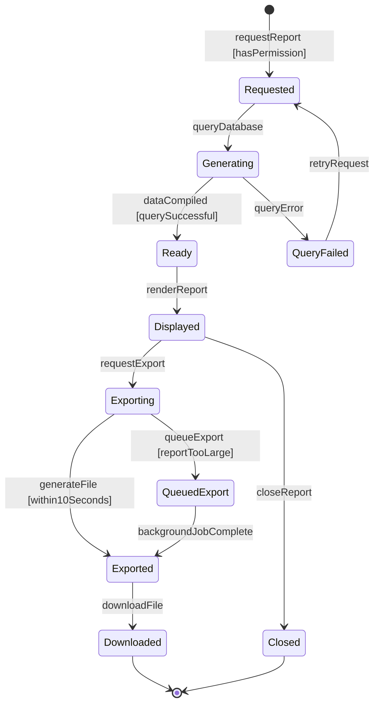

[STATE_TRANSITION_DIAGRAMS.md](https://github.com/user-attachments/files/26781291/STATE_TRANSITION_DIAGRAMS.md)
# STATE_TRANSITION_DIAGRAMS.md — Object State Modeling
## Smart Academic Library Assistance System (SALAS)

> Assignment 8: Object State Modeling and Activity Workflow Modeling
> Building on Assignments 3–7 |19 April 2026

---

## 1. Book / Resource Object

### Explanation

**Key States:** Available, Reserved, Borrowed, Overdue, UnderMaintenance, Lost, Deleted

**Key Transitions:**
- A book starts as Available when a librarian adds it via `addResource` (FR-06)
- `reserveBook` moves it to Reserved; `checkoutBook` moves it directly to Borrowed
- The guard `[userAuthenticated && withinHoldPeriod]` on Reserved → Borrowed ensures only eligible students can collect a reserved book
- `dueDatePassed [notReturned]` triggers the Overdue state, which activates FR-07 notifications
- The guard `[noActiveLoans]` on Available → Deleted enforces the FR-06 deletion rule
- `Deleted` is the explicit UML terminal state before `[*]`

**Functional Requirements Mapping**
- FR-03: Governs reserveBook, checkoutBook, and returnBook transitions
- FR-06: Governs addResource, deleteResource, and the noActiveLoans guard
- FR-07: Triggered by the dueDatePassed transition into Overdue

---

## 2. Loan Object

### Explanation

**Key States:** Active, DueSoon, Renewed, Overdue, Escalated, Returned, Archived

**Key Transitions:**
- `createLoan` initialises the loan as Active when a student borrows a book
- `scheduleReminder [daysUntilDue == 3]` triggers the DueSoon state and FR-07 email
- `escalateFine [fineExceedsR100]` enforces the FR-03 guard: borrowing blocked when fines exceed R100
- `payFineAndReturn [paymentSuccessful]` includes a payment guard before the loan can close
- `Archived` is the explicit terminal state confirming the loan record is stored and the lifecycle is complete

**Functional Requirements Mapping**
- FR-03: Controls Active, Overdue, Escalated states and the fineExceedsR100 guard
- FR-07: Triggers the scheduleReminder and dueDatePassed transitions

---

## 3. User Account Object

### Explanation

**Key States:** Unverified, Active, Locked, Suspended, Deactivated, DataErased, Expired

**Key Transitions:**
- `registerAccount` creates an Unverified account; `verifyEmail [linkValid]` activates it
- `lockAccount [failedAttempts >= 5]` enforces brute-force protection (NFR-10)
- `verificationTimeout [linkExpiredAfter7Days]` moves unverified accounts to Expired, an explicit terminal state
- `erasePersonalData [within30Days]` in DataErased enforces POPIA compliance (NFR-11)

**Functional Requirements Mapping**
- FR-01: Governs registerAccount, verifyEmail, and lockAccount transitions
- NFR-10: Defines the failedAttempts >= 5 guard condition
- NFR-11: Governs the erasePersonalData transition and 30-day guard

---

## 4. Reservation Object

### Explanation

**Key States:** Pending, Confirmed, Queued, Collected, Expired, Cancelled, Fulfilled, NextActivated

**Key Transitions:**
- `confirmReservation [bookAvailable]` and `joinQueue [bookUnavailable]` branch based on availability
- `collectBook [withinHoldPeriod]` enforces the 48-hour hold window guard from FR-03
- `reservationTimeout [holdPeriodExceeded]` moves to Expired, triggering `activateNextReservation`
- `Fulfilled`, `Cancelled`, and `NextActivated` are explicit terminal states

**Functional Requirements Mapping**
- FR-03: Governs the entire reservation lifecycle and all guard conditions

---

## 5. Notification Object

### Explanation

**Key States:** Scheduled, Sending, Delivered, Failed, Retrying, PermanentFailure, Archived, FallbackDelivered

**Key Transitions:**
- `scheduleNotification [triggerConditionMet]` fires when due date conditions are met (FR-07)
- `retryDelivery [retryCount < 3]` and `exhaustRetries [retryCount >= 3]` are explicit guard conditions enforcing the 3-retry rule
- `Archived` (success path) and `FallbackDelivered` (failure path) are both explicit UML terminal states

**Functional Requirements Mapping**
- FR-07: Defines all trigger conditions, the 3-retry guard, and the in-app fallback

---

## 6. Recommendation Object

### Explanation

**Key States:** Pending, Generating, Ready, FallbackMode, Displayed, Dismissed, Actioned, FeedbackRecorded

**Key Transitions:**
- `generateRecommendations` runs the collaborative filtering algorithm
- `recommendationsReady [historyAvailable]` and `applyDefaults [insufficientHistory]` branch on the cold-start guard
- `courseDefaultsAssigned [within1Hour]` enforces the FR-05 1-hour SLA for new students
- Both Dismissed and Actioned converge on `FeedbackRecorded` the explicit terminal state

**Functional Requirements Mapping**
- FR-05: Governs the full recommendation lifecycle and cold-start guard
- FR-04: The Displayed state is triggered when the student dashboard loads

---

## 7. Library Catalogue Entry Object

### Explanation

**Key States:** Draft, Active, Indexing, Searchable, IndexFailed, Updating, PendingDeletion, Deleted, Discarded

**Key Transitions:**
- `submitEntry [isbnValid]` enforces ISBN-10/13 validation before the entry becomes Active
- `indexingComplete [within30Seconds]` enforces the FR-06 30-second indexing SLA
- `blockDeletion [activeLoansExist]` and `confirmDeletion [noActiveLoans]` are explicit guard conditions protecting data integrity
- `Deleted` and `Discarded` are explicit terminal states

**Functional Requirements Mapping**
- FR-06: Governs the full catalogue lifecycle, isbnValid guard, and deletion guards
- FR-02: The Searchable state enables student search via Elasticsearch

---

## 8. Report Object

### Explanation

**Key States:** Requested, Generating, Ready, Displayed, Exporting, Exported, QueuedExport, Downloaded, Closed

**Key Transitions:**
- `requestReport [hasPermission]` enforces RBAC at the entry point, FR-10 ensures admin-only reports reject librarians
- `generateFile [within10Seconds]` enforces the FR-08 10-second export SLA
- `queueExport [reportTooLarge]` handles the alternative flow for large reports
- `Downloaded` and `Closed` are both explicit terminal states covering the two exit paths

**Functional Requirements Mapping**
- FR-08: Governs report generation, display, export, and the 10-second SLA guard
- FR-10: Enforces the hasPermission guard at the entry point
