# USE_CASE_DIAGRAM.md Use Case Diagram
## Smart Academic Library Assistance System (SALAS)

> Assignment 5: Use Case Modeling  
> Building on Assignments 3 & 4 SALAS  
> Date: March 2026

---

## 1. Use Case Diagram

```mermaid
flowchart TD
    %% Actors
    STU(["👤 Student"])
    LIB(["👤 Librarian"])
    ADM(["👤 Administrator"])
    IT(["👤 IT Administrator"])
    ACC(["👤 Accessibility User"])
    EXT(["👤 External System\n(University Portal / Mobile App)"])
    REC(["🤖 Recommendation Engine"])

    %% System boundary
    subgraph SALAS["SALAS — System Boundary"]

        %% Authentication
        UC01["UC01\nRegister / Login"]
        UC10["UC10\nManage Roles & Permissions"]

        %% Search
        UC02["UC02\nSearch Library Catalogue"]
        UC02A["UC02a\nApply Filters\n≪include≫"]
        UC02B["UC02b\nCheck Real-Time Availability\n≪include≫"]

        %% Borrowing
        UC03["UC03\nBorrow / Reserve Book"]
        UC03A["UC03a\nCheck Borrow Eligibility\n≪include≫"]
        UC03B["UC03b\nSend Reservation Email\n≪include≫"]

        %% Dashboard
        UC04["UC04\nView Student Dashboard"]
        UC04A["UC04a\nView Borrowing History\n≪extend≫"]
        UC04B["UC04b\nView Overdue Notices\n≪extend≫"]

        %% Recommendations
        UC05["UC05\nReceive Personalized\nRecommendations"]
        UC05A["UC05a\nDismiss Recommendation\n≪extend≫"]

        %% Catalogue Management
        UC06["UC06\nManage Library Catalogue"]
        UC06A["UC06a\nBulk Import via CSV\n≪extend≫"]

        %% Notifications
        UC07["UC07\nReceive Overdue\nNotifications"]

        %% Reporting
        UC08["UC08\nGenerate Usage Reports"]
        UC08A["UC08a\nExport Report as PDF/CSV\n≪extend≫"]

        %% API
        UC09["UC09\nAccess REST API"]

        %% Reading List
        UC11["UC11\nManage Reading List"]
        UC11A["UC11a\nExport Bibliography\n≪extend≫"]

        %% Return Book
        UC12["UC12\nReturn Borrowed Book"]

    end

    %% Student interactions
    STU --> UC01
    STU --> UC02
    STU --> UC03
    STU --> UC04
    STU --> UC05
    STU --> UC07
    STU --> UC11
    STU --> UC12

    %% Accessibility user extends student (generalization)
    ACC --> UC02
    ACC --> UC04

    %% Librarian interactions
    LIB --> UC01
    LIB --> UC06
    LIB --> UC07
    LIB --> UC08
    LIB --> UC12

    %% Administrator interactions
    ADM --> UC08
    ADM --> UC10

    %% IT Admin interactions
    IT --> UC10

    %% External system interactions
    EXT --> UC09
    EXT --> UC01

    %% Recommendation Engine
    REC --> UC05

    %% Include relationships
    UC02 --> UC02A
    UC02 --> UC02B
    UC03 --> UC03A
    UC03 --> UC03B

    %% Extend relationships
    UC04 --> UC04A
    UC04 --> UC04B
    UC05 --> UC05A
    UC06 --> UC06A
    UC08 --> UC08A
    UC11 --> UC11A

    %% Styling
    style SALAS fill:#f0f4ff,stroke:#1168BD,stroke-width:2px
    style STU fill:#08427B,color:#fff,stroke:#052e56
    style LIB fill:#08427B,color:#fff,stroke:#052e56
    style ADM fill:#08427B,color:#fff,stroke:#052e56
    style IT fill:#08427B,color:#fff,stroke:#052e56
    style ACC fill:#08427B,color:#fff,stroke:#052e56
    style EXT fill:#666,color:#fff,stroke:#444
    style REC fill:#666,color:#fff,stroke:#444
```

---

## 2. Actors and Their Roles

| Actor | Role | Linked FR |
|---|---|---|
| **Student** | Primary end-user. Searches for resources, borrows/reserves books, views dashboard, manages reading list, and receives recommendations. | FR-01, FR-02, FR-03, FR-04, FR-05, FR-07, FR-11 |
| **Librarian** | Manages the library catalogue, processes book returns, monitors overdue items, and accesses usage reports. | FR-01, FR-06, FR-07, FR-08 |
| **Administrator** | University management. Views system-wide analytics, generates reports, and manages user roles and permissions. | FR-08, FR-10 |
| **IT Administrator** | Manages system infrastructure, user roles, and security policies. | FR-10 |
| **Accessibility User** | A specialization of the Student actor — uses the same flows but relies on WCAG-compliant navigation (keyboard, screen reader). Generalization relationship with Student. | FR-02, FR-04, FR-12 |
| **External System** | University Portal or Mobile App consuming the SALAS REST API to integrate library features into external platforms. | FR-09 |
| **Recommendation Engine** | Internal automated actor. Runs batch recommendation jobs and feeds personalized results into the student dashboard. | FR-05 |

---

## 3. Key Relationships Explained

### Include Relationships (≪include≫)
These represent mandatory sub-steps that always occur as part of a parent use case:

- **UC02 Search → UC02a Apply Filters**: Every search interaction includes the ability to apply filters (author, genre, availability). The filter engine is always invoked even if no filter is selected.
- **UC02 Search → UC02b Check Real-Time Availability**: Search results always include live availability status fetched from the inventory — this is non-optional.
- **UC03 Borrow/Reserve → UC03a Check Borrow Eligibility**: Before any borrowing action, the system always checks whether the student has overdue items or unpaid fines exceeding R100.
- **UC03 Borrow/Reserve → UC03b Send Reservation Email**: A confirmation email is always sent upon successful reservation placement.

### Extend Relationships (≪extend≫)
These represent optional or conditional behaviour that extends a base use case:

- **UC04 Dashboard → UC04a View Borrowing History**: Students may optionally drill down into their full borrowing history from the dashboard.
- **UC04 Dashboard → UC04b View Overdue Notices**: Overdue alerts are conditionally shown only when a student has overdue items.
- **UC05 Recommendations → UC05a Dismiss Recommendation**: Students may optionally dismiss any recommendation, feeding back into the model.
- **UC06 Catalogue Management → UC06a Bulk Import via CSV**: Librarians may optionally use bulk CSV upload instead of manual entry.
- **UC08 Reports → UC08a Export PDF/CSV**: Admins may optionally export any report to PDF or CSV format.
- **UC11 Reading List → UC11a Export Bibliography**: Students may optionally export their reading list as a formatted bibliography.

### Generalization
- **Accessibility User → Student**: The Accessibility User is a specialization of the Student actor. They perform all the same use cases but interact with the system through assistive technologies (screen readers, keyboard navigation). This maps to FR-12 and NFR-01.

---

## 4. Alignment with Stakeholder Concerns (Assignment 4)

| Stakeholder Concern (from STAKEHOLDERS.md) | Addressed By Use Case |
|---|---|
| Students struggle to find resources efficiently | UC02 — Natural language search with filters and real-time availability |
| No online reservation system | UC03 — Full online borrow and reservation flow |
| No personalized suggestions | UC05 — Recommendation Engine-driven personalized results |
| No visibility into due dates or fines | UC04, UC07 — Dashboard and automated overdue notifications |
| Manual catalogue updates are slow | UC06, UC06a — Catalogue management with CSV bulk import |
| No usage data for procurement decisions | UC08 — Full analytics and exportable reporting |
| API needed for university portal integration | UC09 — Versioned REST API with OpenAPI docs |
| Poor accessibility for students with disabilities | UC02, UC04 with Accessibility User generalization + FR-12 |
| Role-based access control required | UC10 — RBAC managed by Admin and IT Administrator |
