# assignment11_class_diagram.md — Repository Layer Class Diagram
## Smart Academic Library Assistance System (SALAS)

> Assignment 11: Updated Class Diagram showing Repository interfaces and implementations
> Building on Assignment 9 Class Diagram |May 2026

---

## Repository Layer Class Diagram

```mermaid
classDiagram
    direction TB

    class Repository~T,ID~ {
        <<interface>>
        +save(T) void
        +find_by_id(ID) Optional~T~
        +find_all() List~T~
        +delete(ID) void
    }

    class UserRepository {
        <<interface>>
        +find_by_email(str) Optional~User~
        +find_by_role(str) List~User~
        +find_active_users() List~User~
    }

    class ResourceRepository {
        <<interface>>
        +find_by_title(str) List~Resource~
        +find_by_author(str) List~Resource~
        +find_by_isbn(str) Optional~Resource~
        +find_available() List~Resource~
        +find_by_genre(str) List~Resource~
        +search(str) List~Resource~
    }

    class LoanRepository {
        <<interface>>
        +find_by_student(str) List~Loan~
        +find_active_by_student(str) List~Loan~
        +find_overdue() List~Loan~
        +find_due_within_days(int) List~Loan~
        +find_by_resource(str) List~Loan~
    }

    class ReservationRepository {
        <<interface>>
        +find_by_student(str) List~Reservation~
        +find_active_by_resource(str) List~Reservation~
        +find_expired() List~Reservation~
        +find_queue_for_resource(str) List~Reservation~
    }

    class InMemoryUserRepository {
        -_storage: Dict
        +save(User) void
        +find_by_id(str) Optional~User~
        +find_all() List~User~
        +delete(str) void
        +find_by_email(str) Optional~User~
        +find_by_role(str) List~User~
        +find_active_users() List~User~
        +count() int
        +exists(str) bool
        +clear() void
    }

    class InMemoryResourceRepository {
        -_storage: Dict
        +save(Resource) void
        +find_by_id(str) Optional~Resource~
        +find_all() List~Resource~
        +delete(str) void
        +search(str) List~Resource~
        +find_available() List~Resource~
        +count() int
        +exists(str) bool
        +clear() void
    }

    class InMemoryLoanRepository {
        -_storage: Dict
        +save(Loan) void
        +find_by_id(str) Optional~Loan~
        +find_all() List~Loan~
        +delete(str) void
        +find_overdue() List~Loan~
        +find_by_student(str) List~Loan~
        +count() int
        +exists(str) bool
        +clear() void
    }

    class FileSystemResourceRepository {
        -_file_path: str
        +save(Resource) void
        +find_by_id(str) Optional~Resource~
        +find_all() List~Resource~
        +delete(str) void
        +search(str) List~Resource~
        +count() int
    }

    class FileSystemUserRepository {
        -_file_path: str
        +save(User) void
        +find_by_id(str) Optional~User~
        +find_all() List~User~
        +delete(str) void
        +find_by_email(str) Optional~User~
    }

    class DatabaseResourceRepository {
        -_connection_string: str
        +save(Resource) void
        +find_by_id(str) Optional~Resource~
        +find_all() List~Resource~
        +delete(str) void
        +search(str) List~Resource~
    }

    class RepositoryFactory {
        +get_user_repository(str) UserRepository
        +get_resource_repository(str) ResourceRepository
        +get_loan_repository(str) LoanRepository
        +get_reservation_repository(str) ReservationRepository
        +get_all(str) dict
    }

    %% Generic base → entity-specific interfaces
    Repository <|-- UserRepository : extends
    Repository <|-- ResourceRepository : extends
    Repository <|-- LoanRepository : extends
    Repository <|-- ReservationRepository : extends

    %% Entity interfaces → in-memory implementations
    UserRepository <|-- InMemoryUserRepository : implements
    ResourceRepository <|-- InMemoryResourceRepository : implements
    LoanRepository <|-- InMemoryLoanRepository : implements

    %% Entity interfaces → filesystem implementations
    ResourceRepository <|-- FileSystemResourceRepository : implements
    UserRepository <|-- FileSystemUserRepository : implements

    %% Entity interfaces → database stub
    ResourceRepository <|-- DatabaseResourceRepository : implements

    %% Factory creates repositories
    RepositoryFactory --> UserRepository : creates
    RepositoryFactory --> ResourceRepository : creates
    RepositoryFactory --> LoanRepository : creates
    RepositoryFactory --> ReservationRepository : creates
```

---

## How to Read This Diagram

**Inheritance chain:** `Repository[T,ID]` → `UserRepository` → `InMemoryUserRepository`

The generic `Repository[T, ID]` interface (top) defines the four CRUD operations. Entity-specific interfaces (`UserRepository`, `ResourceRepository`, etc.) extend it and add domain queries. Concrete implementations (`InMemoryUserRepository`, `FileSystemResourceRepository`, etc.) implement the entity interface and add concrete-only helpers (`count()`, `exists()`, `clear()`).

**Factory:** `RepositoryFactory` is the only class that knows which concrete implementation to return. All business logic depends only on the interfaces — never on concrete classes.

**Future-proofing:** `DatabaseResourceRepository` shows the pattern for Sprint 5. Adding it required only implementing the existing `ResourceRepository` interface — zero changes to `RepositoryFactory`'s method signatures or any service layer code.
